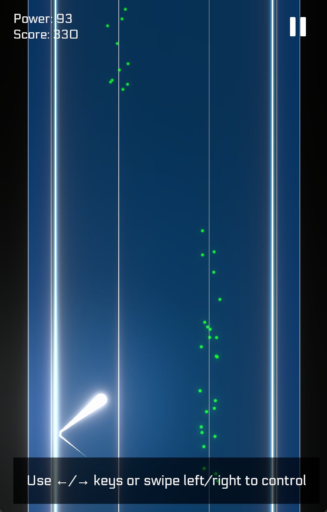
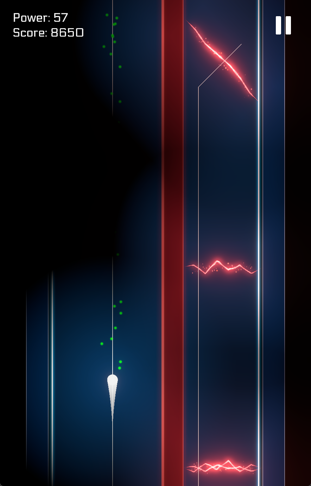
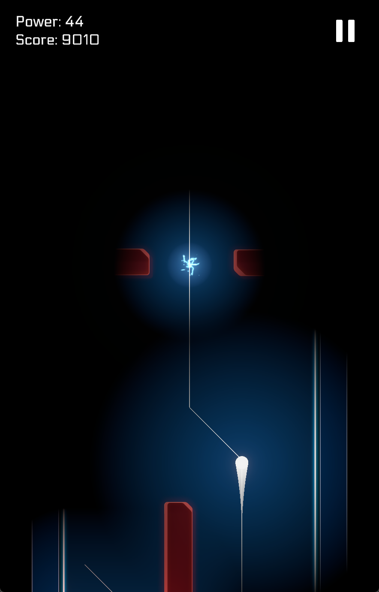
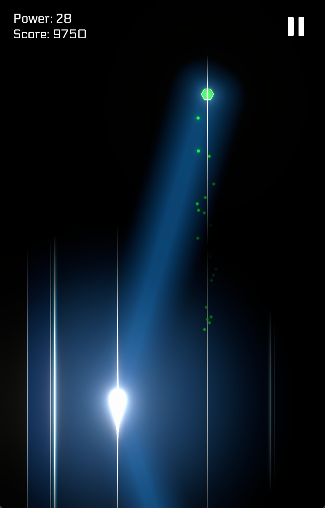
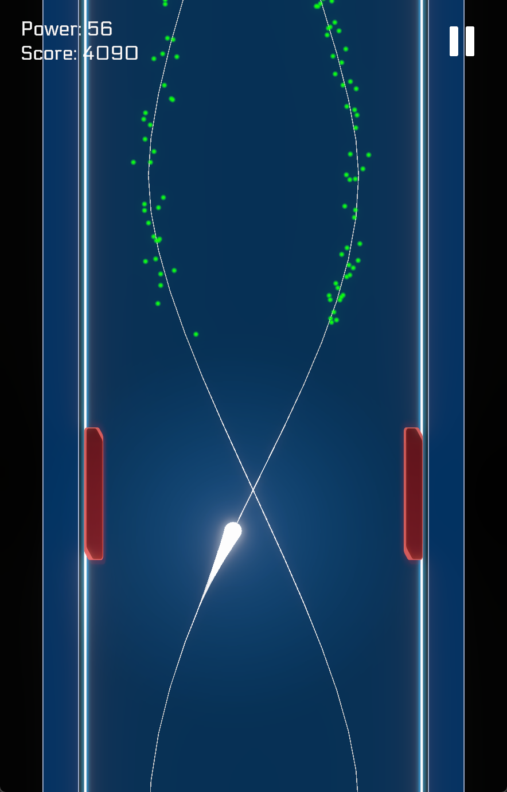

# Electro Dash

Play now at: https://brianjiang.itch.io/electro-dash

A game made for [Gamedev.js Jam 2025](https://itch.io/jam/gamedevjs-2025).

Controls: ←/→ keys on PC, swipe left/right on mobile.

Embark on a journey as an electron on a circuit board, find your balance in a world of lights and dark. Collect energy powers along the way and smash viral blocks to earn score.

